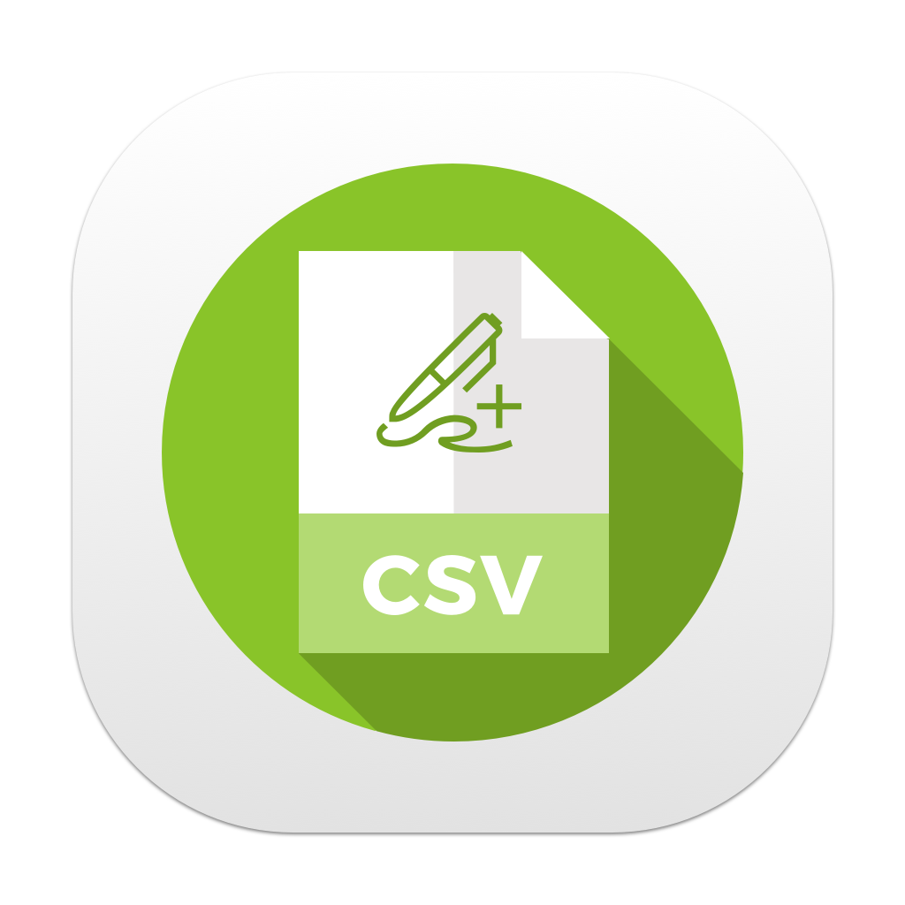

# CSV Editor

    

A simple and lightweight CSV editor for macOS, designed for quick and efficient editing of CSV files. Easily open, modify, and save your CSV data with an intuitive interface.

## Features

-   Open and edit existing CSV files
-   Add, edit, and delete rows and columns
-   Lightweight and fast performance
-   Seamless macOS integration

## Getting Started

### Download & Install

1. Download the latest version from the [Releases Page](https://github.com/dikayx/csveditor/releases).
2. Unzip the downloaded file.
3. Drag the app into your **Applications** folder.
4. Launch the app from **Launchpad** or Finder.

### Usage

-   Open a CSV file by double-clicking or using **File > Open**.
-   Modify data by selecting and editing cells.
-   Save changes via **File > Save** or **Cmd + S**.

## License

This project is licensed under the MIT License. See the [LICENSE](LICENSE) file for more details.

## Credits

This app is inspired by Karin Prater's tutorial. Check out the original repository [here](https://github.com/gahntpo/CSVEditor).

---

For any issues or feature requests, feel free to open an [issue](https://github.com/dikayx/csveditor/issues) on GitHub!
